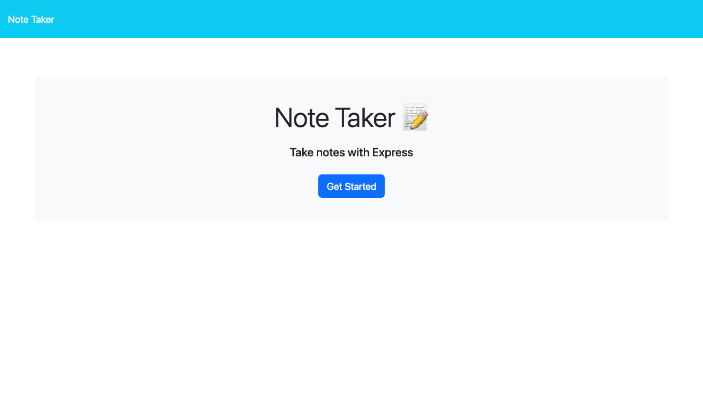
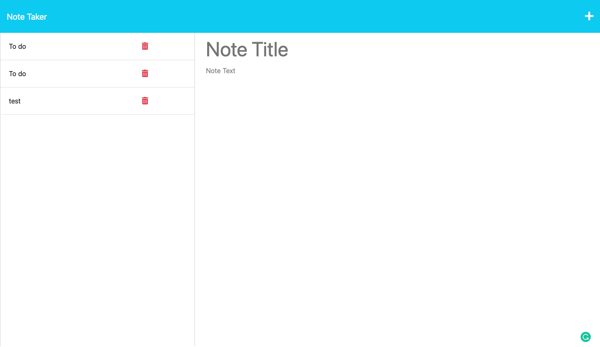

# NoteTaker
## Description
This is an application developed for user to make their daily life easy. User can write and save  notes for a reminder.

## Table of Contents
- [Technology](#technology)
- [Installation](#installation)
- [Usage](#usage)
- [Contribution](#contribution)
- [Application](#application)
- [Questions](#questions)

## Technology
Javascript, Node.js, Express.js

## Installation
Clone this repository https://github.com/KritiShrestha/notetaker to your local machine. Open the project in your VS code and run 'node server.js' in a command line. You can also see the application by going in a live server in heroku

## Usage
This application is used for users where they can write and save  notes for a reminder.

## Application
Here's the link to the deployed application on heroku https://noteyourday.herokuapp.com/

## Contribution
Kriti Shrestha

## Questions
You can find me on Github at [KritiShrestha](https://github.com/KritiShrestha)
Feel free to reach me out at shrkriti07@gmail.com if you have any additional questions

